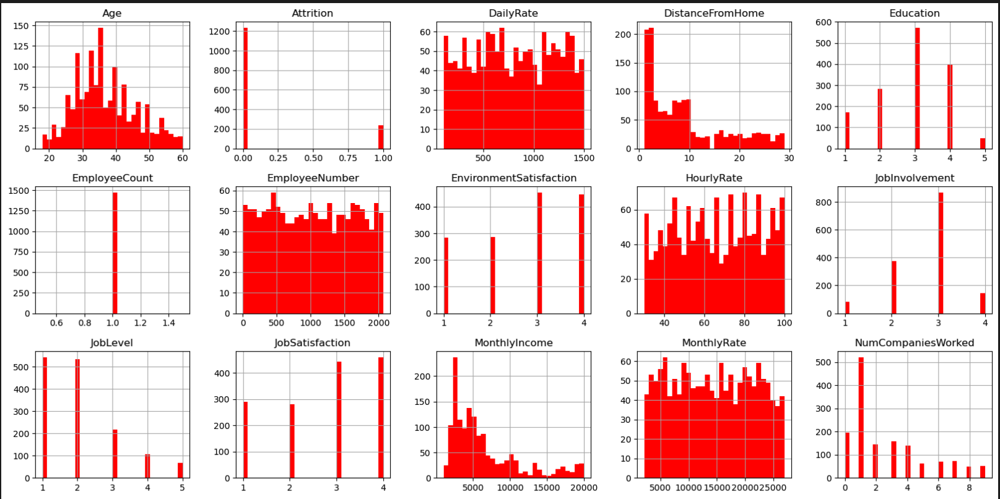

# Portfolio
- [Data Engineering and Data Warehousing](#data-engineering-and-data-warehousing)
- [Machine Learning](#machine-learning)
- [Data Visualization](#data-visualization)
- [Data Mining and Statistic Analysis](#data-mining-and-statistic-analysis)
- [Cloud Computing](#cloud-computing)  
- [Work Experience](#work-experience)
- [Education](#education)
- [Certificates](#certificates)

---
## Data Engineering and Data Warehousing
> 
### Skills
PostgreSQL, MySQL, APIs, NoSQL(MongoDB), SQLite, ETL, Beautiful Soup, Spark, Big data
### Projects
1. [Movies ETL Pipeline](https://github.com/CelineWW/Movies-ETL) Extract and transform Movie data from different sources including Wikipedia, Kaggle metadata and local file. well-structured dataset (26M records) was loaded into SQL for further queries.
2. [Amazon Vine Review Big Data](https://github.com/CelineWW/Amazon_Vine_Bias_Pyspark) Analyze Amazon Office Products reviews via AWS RDS to determine if there is any prior bias toward leaving reviews from Amazon Vine.
3. [Plan My Trip APIs](https://github.com/CelineWW/Plan_My_Trip_APIs) Recommend hotels in target city and travel routes based on customer's weather preferences.
4. [Mars Web Scaping](https://github.com/CelineWW/Mars_Web_Scrapping) Reorganize the Mars information from multiple websites into a customized flask app.

[](https://github.com/CelineWW/Movies_ETL)

---
## Machine Learning
>
### Skills
Scikit-learn, Tensorflow, Numpy, Pandas, Seaborn, Python, VS Code, Jupyter Notebook, Google Colab
### Projects
1. [FoodMart Media Campaign](https://github.com/CelineWW/FoodMart_Media_Campaign) Predict store sales and media cost with multiple linear regression. Classify customer membership with deep neural network. 
2. [Credit Risk Prediction](https://github.com/CelineWW/Credit_Risk_Prediction) Predict customer credit risk with logistic regression and classifier models using resampling methods. Compare the model perform metrics before and after scaling.
3. [Cryptocurrencies Clustering](https://github.com/CelineWW/Cryptocurrencies_Clustering) Cluster cryptocurrencies using KMeans Clustering from the view of elbow curve.
4. [Charity Foundation](https://github.com/CelineWW/Neural_Network_Charity_Analysis) Predict funding success with Neural Network and optimize the model by re-preprocessing data and fine tuning hyperparameters.

[](https://celineww.github.io/FoodMart_Media_Campaign/)


---
## Data Visualization 
> 
### Skills
Flask, Matplotlib, Tableau, HTML, CSS, Javascript, Plotly, Leaflet
### Projects
1. [SuperStore Analysis](https://public.tableau.com/app/profile/celine7593/viz/SuperStore_16767861451250/SuperStoreStory) Show patterns and trends of sales, products, and customer analysis on Tableau.
2. [Biodiversity Ploty Dashboard](https://github.com/CelineWW/Biodiversity_Plotly_Dashboard) Create an interactive dashboard to display bacteria cultures of each test object.
3. [Mapping Earthquake](https://github.com/CelineWW/Mapping_Earthquakes) Visualize earthquakes in past 7 days around the world and its relation to tectonic plates.

[](https://public.tableau.com/views/AmazingMartSalesAnalysis_16770489812220/Dashboard?:language=en-US&:display_count=n&:origin=viz_share_link) 

---
## Data Mining and Statistic Analysis 
> 
### Skills
Python, Pandas, Numpy, R, MS Excel
### Projects
1. [Employee Attrition Prediction](https://github.com/CelineWW/Employee_Attrition_Prediction) Discover the relationship between duration of employment and employee's demographics. Based on result, predict employee attrition by multiple ML model. 
2. [Stock_Analysis_Excel_VBA](https://github.com/CelineWW/Stock_Analysis_Excel_VBA) Create stock index and calculate total daily volume and returns.
3. [MechaCar R Statistical Analysis](https://github.com/CelineWW/MechaCar_Statistical_Analysis) Determine significant features that mostly impact MPG with multiple linear regression. Identify product quality from the statistics summary and t-test.

[](https://github.com/CelineWW/Employee_Attrition_Prediction) 

---
## Cloud Computing
> 
### Skills
AWS, Google Cloud Planform, Terroform, Docker, Kubernetes
### Projects
1. [Covid Testing MultiCloud](/pdf/MultiCloud_computing.pdf) Deploy hotel customer covid test system docker container application running in the Google cloud, whereas saving customer's privacy on AWS.

[](https://github.com/CelineWW/Covid_Testing_Cloud_Data)

---
## Work Experience 
<dl>
<dt>Learning Assistant (Instructional Specialist)</dt>
<dd>Data Analytics and Visualization Program in 2U | 03/2023 - present</dd>
</dl>
  
---
## Education

<!-- | Degree             | Major                                            | Institution                         | Period           |
|:-------------------|:-------------------------------------------------|:------------------------------------|:-----------------|
| Boot Camp          | Data Science and Visualization                   | University of California San Diego  | 05/2022 -11/2022 |
| Master of Education| Curriculum and Teaching Methodology (Chemistry)  | Nanjing Normal University(China)    | 09/2007 -07/2010 |
| Bachelor of Science| Chemistry                                        | Anhui Normal University(China)      | 09/2003 -07/2007 |  -->

<dl>
<dt>Data Science and Visualization Boot Camp</dt>
<dd>University of California San Diego | 05/2022 -11/2022</dd>
<dt>M.Ed. in Chemistry Education</dt>
<dd>Nanjing Normal University(China) | 09/2007 -07/2010</dd>
<dt>B.S. in Chemistry</dt>
<dd>Anhui Normal University | 09/2003 -07/2007</dd>
</dl>

---
## Certificates
  - Machine Learning Specialization --**Deeplearning.AI**
  - Data science and visualization --**UCSD**           
  - Intensive Multi-Cloud Computing --**The Cloud Bootcamp**
  - Data Analyst Professional Program  --**Task Impetus**
  - Python, MySQL, MS Excel --**LinkedIn**

<p>
<a href="mailto: wzhj.ce@gmail.com">
</a>
<a href="https://www.linkedin.com/in/cewrs/">
</a>
<a href="https://github.com/CelineWW">
</a> 
</p>


```
😄Thanks for reading!😄
```


