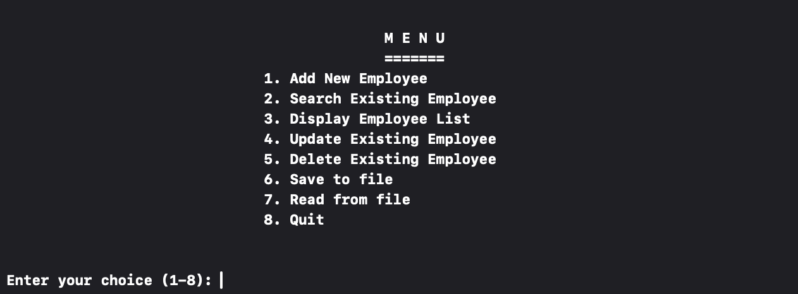

# Portfolio
- [Data Management](#data-management)
- [Machine Learning](#machine-learning)
- [Data Visualization](#data-visualization)
- [Data Mining and Statistic Analysis](#data-mining-and-statistic-analysis)
- [Programming](#programming)
- [Cloud Computing](#cloud-computing)  
- [Work Experience](#work-experience)
- [Education](#education)
- [Certificates](#certificates)

---
## Data Management
> 
### Skills
PostgreSQL, Azure SQL, MySQL, APIs, NoSQL(MongoDB), SQLite, ETL, Beautiful Soup, Spark, Big data, Hyperion
### Projects
1. [Data Queries with Data Engineering](https://github.com/CelineWW/CelineWW.github.io/blob/master/images/SQL-StudentDemographics%20Sample%20.png) Advanced SQL queries and subqueries associated with windows functions was designed and implemented to collect student demographics and program success metrics.
2. [Movies ETL Pipeline](https://github.com/CelineWW/Movies-ETL) Extract and transform Movie data from different sources including Wikipedia, Kaggle metadata and local file. well-structured dataset (26M records) was loaded into SQL for further queries.
3. [Amazon Vine Review Big Data](https://github.com/CelineWW/Amazon_Vine_Bias_Pyspark) Analyze Amazon Office Products reviews via AWS RDS to determine if there is any prior bias toward leaving reviews from Amazon Vine.
4. [Plan My Trip APIs](https://github.com/CelineWW/Plan_My_Trip_APIs) Recommend hotels in target city and travel routes based on customer's weather preferences.
5. [Mars Web Scaping](https://github.com/CelineWW/Mars_Web_Scrapping) Reorganize the Mars information from multiple websites into a customized flask app.

[](https://github.com/CelineWW/Movies_ETL)

---
## Machine Learning
>
### Skills
Scikit-learn, Tensorflow, Numpy, Pandas, Seaborn, VS Code, Jupyter Notebook, Google Colab
### Projects
1. [FoodMart Media Campaign](https://github.com/CelineWW/FoodMart_Media_Campaign) Predict store sales and media cost with multiple linear regression. Classify customer membership with deep neural network.
2. [MercadoLibre_Financial_Forecast](https://github.com/CelineWW/MercadoLibre_Financial_Forecast) Based on google search data, company stock price, and revenue data to get insights and forecasting for the better plan. 
3. [Credit Risk Prediction](https://github.com/CelineWW/Credit_Risk_Prediction) Predict customer credit risk with logistic regression and classifier models using resampling methods. Compare the model perform metrics before and after scaling.
4. [Cryptocurrencies Clustering](https://github.com/CelineWW/Cryptocurrencies_Clustering) Cluster cryptocurrencies using KMeans Clustering from the view of elbow curve.
5. [Charity Foundation](https://github.com/CelineWW/Neural_Network_Charity_Analysis) Predict funding success with Neural Network and optimize the model by re-preprocessing data and fine tuning hyperparameters.

[](https://celineww.github.io/FoodMart_Media_Campaign/)


---
## Data Visualization 
> 
### Skills
Flask, Matplotlib, Tableau, HTML, CSS, Javascript, Plotly, Leaflet
### Projects
1. [Project Log](https://github.com/CelineWW/CelineWW.github.io/blob/master/images/Power%20BI%20-%20Project%20Log.png) Analyzed team organization and hour tracking with Power BI, including time lapse, search bar, keyword lists, and hierarchical filters. 
2. [SuperStore Analysis](https://public.tableau.com/app/profile/celine7593/viz/SuperStore_16767861451250/SuperStoreStory) Show patterns and trends of sales, products, and customer analysis on Tableau.
3. [Funding Startups](https://public.tableau.com/app/profile/celine7593/viz/FundingStartups/FundingStartupsStory) Target startup companies with threshold of expenses, revenue, and top growth.  
4. [Biodiversity Ploty Dashboard](https://github.com/CelineWW/Biodiversity_Plotly_Dashboard) Create an interactive dashboard to display bacteria cultures of each test object.
5. [Mapping Earthquake](https://github.com/CelineWW/Mapping_Earthquakes) Visualize earthquakes in past 7 days around the world and its relation to tectonic plates.

[](https://public.tableau.com/views/AmazingMartSalesAnalysis_16770489812220/Dashboard?:language=en-US&:display_count=n&:origin=viz_share_link) 

---
## Data Mining and Statistic Analysis 
> 
### Skills
Python, Pandas, Numpy, R, MS Excel, SPSS
### Projects
1. [Employee Attrition Prediction](https://github.com/CelineWW/Employee_Attrition_Prediction) Discover the relationship between duration of employment and employee's demographics. Based on result, predict employee attrition by multiple ML model. 
2. [Stock Analysis Excel VBA](https://github.com/CelineWW/Stock_Analysis_Excel_VBA) Create stock index and calculate total daily volume and returns.
3. [MechaCar R Statistical Analysis](https://github.com/CelineWW/MechaCar_Statistical_Analysis) Determine significant features that mostly impact MPG with multiple linear regression. Identify product quality from the statistics summary and t-test.
4. [Chemistry teaching efficacy Analysis](https://www.linkedin.com/in/cewrs/details/education/1635508650263/single-media-viewer/?profileId=ACoAADcU6EEBURplSVqYgErySCnuAQs7gHix8BU) Developed and analyzed surveys on high school chemistry teaching efficacy using SPSS. Conducted exploratory and statistical analyses (t-tests, ANOVA, factor analysis) and incorporated interviews and observations to propose improvements from a psychological perspective.

[](https://github.com/CelineWW/Employee_Attrition_Prediction) 

---
## Programming
> 
### Skills
C++, Python, Java, JavaScript (HTML, CSS, Flask), Data Structures, Algorithms, Pointers, R, Assembly language
### Projects
1. [Banking](https://github.com/CelineWW/Banking_in_CPP) Create a superclass Account and subclass Checking and Saving to allow customer to create Checking and Saving account with a unique ID for transactions independently and interactively.
2. [Election Analysis](https://github.com/CelineWW/PyPoll_Election_Python) Calculate the number of votes and vote turnout for each candidate to determine a local congressional election results.
[](https://github.com/CelineWW/List_of_Employees)

---
## Cloud Computing
> 
### Skills
AWS, Google Cloud Planform, Terroform, Docker, Kubernetes
### Projects
1. [Covid Testing MultiCloud](/pdf/MultiCloud_Computing.pdf) Deploy hotel customer covid test system docker container application running in the Google cloud, whereas saving customer's privacy on AWS.

[](https://github.com/CelineWW/Covid_Testing_Cloud_Data)


---
## Work Experience 
<dl>
<dt>Research Assistant III</dt>
<dd>San Diego College of Continuing Education | 01/2024 - present</dd>
</dl>
<dl>
<dt>Instructional Specialist (Learning Assistant)</dt>
<dd>Data Analytics and Visualization in 2U(edX) | 03/2023 - 01/2024</dd>
</dl>
<dl>
<dt>Mandarin Chinese Teacher</dt>
<dd>Tri-Cities Chinese Language School | 01/2019 - 12/2019</dd>
</dl>
<dl>
<dt>R&D Chemist and Technical Consultant</dt>
<dd>Nikken Chemical Laboratory Co., Ltd., Japan | 08/2015 - 10/2019</dd>
</dl>
<dl>
<dt>Research Associate</dt>
<dd>Electrochemical Energy Lab, Mie University, Japan | 04/2011 - 03/2014</dd>
</dl>

  
---
## Education

<!-- | Degree             | Major                                            | Institution                         | Period           |
|:-------------------|:-------------------------------------------------|:------------------------------------|:-----------------|
| Boot Camp          | Data Science and Visualization                   | University of California San Diego  | 05/2022 -11/2022 |
| Master of Education| Curriculum and Teaching Methodology (Chemistry)  | Nanjing Normal University(China)    | 09/2007 -07/2010 |
| Bachelor of Science| Chemistry                                        | Anhui Normal University(China)      | 09/2003 -07/2007 |  -->

<dl>
<dt>Computer Science and Machine Learning</dt>
<dd>Community College and Coursera | 11/2022 - present</dd>
<dt>Data Science and Visualization Boot Camp</dt>
<dd>University of California San Diego | 05/2022 - 11/2022</dd>
<dt>M.Ed. in Curriculum and Teaching Methodology (Chemistry)</dt>
<dd>Nanjing Normal University (China) | 09/2007 - 07/2010</dd>
<dt>B.S. in Chemistry</dt>
<dd>Anhui Normal University | 09/2003 - 07/2007</dd>
</dl>

---
## Certificates
  - Mathematics for Machine Learning and Data Science --**Deeplearning.AI**
  - Machine Learning Specialization --**Deeplearning.AI**
  - Data science and visualization --**UCSD**           
  - Prompt Engineering and Advanced ChatGPT --**edX**
  - Intensive Multi-Cloud Computing --**The Cloud Bootcamp**
  - Data Analyst Professional Program  --**Task Impetus**
  - Python, Machine Learning, MySQL, MS Excel --**LinkedIn**


<p>
<a href="mailto: wzhj.ce@gmail.com">
</a>
<a href="https://www.linkedin.com/in/cewrs/">
</a>
<a href="https://github.com/CelineWW">
</a> 
</p>


```
😄Thanks for reading!😄
```


